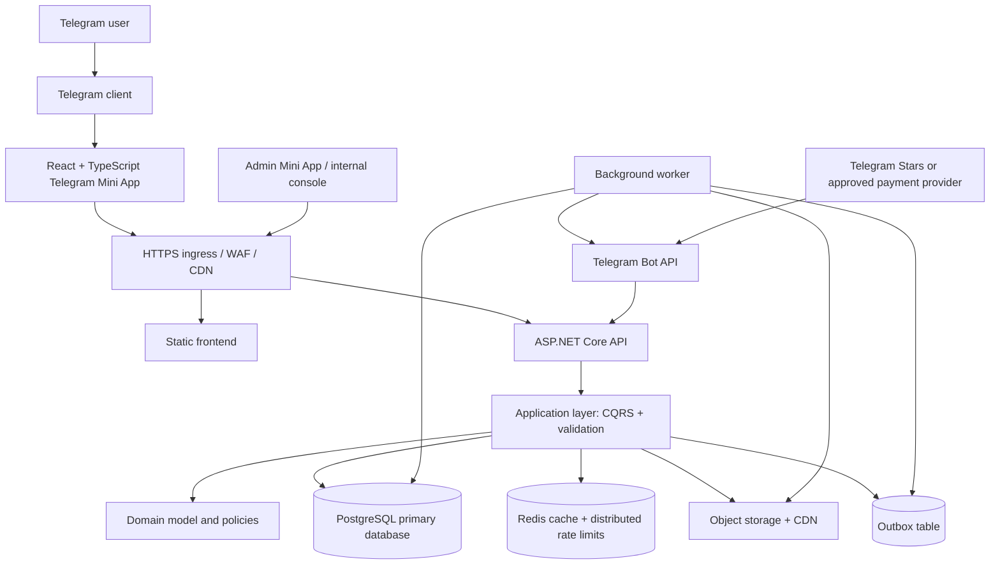
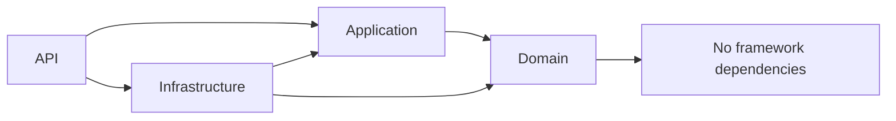
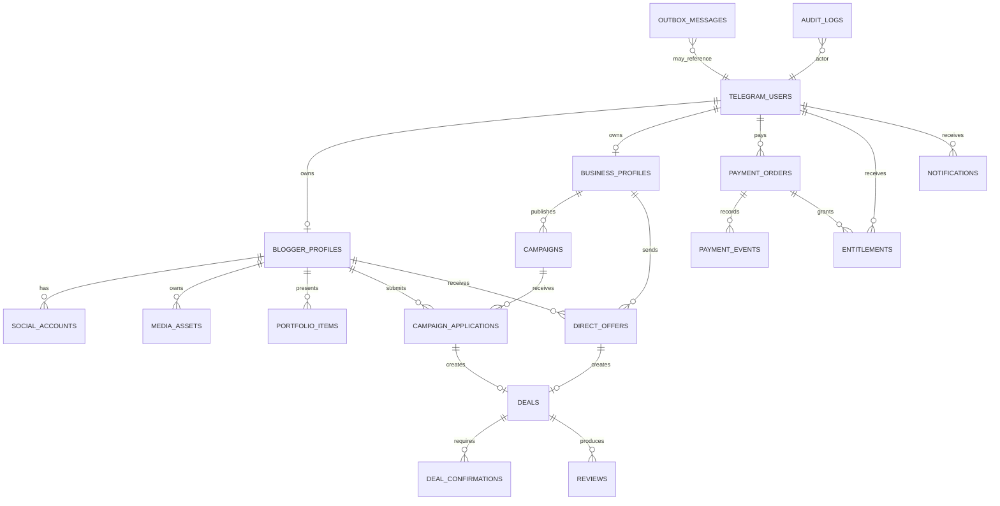
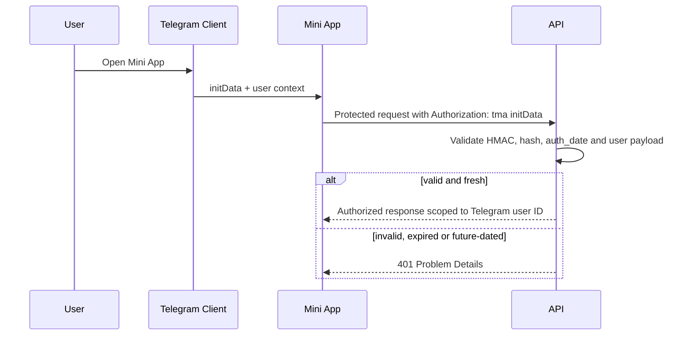
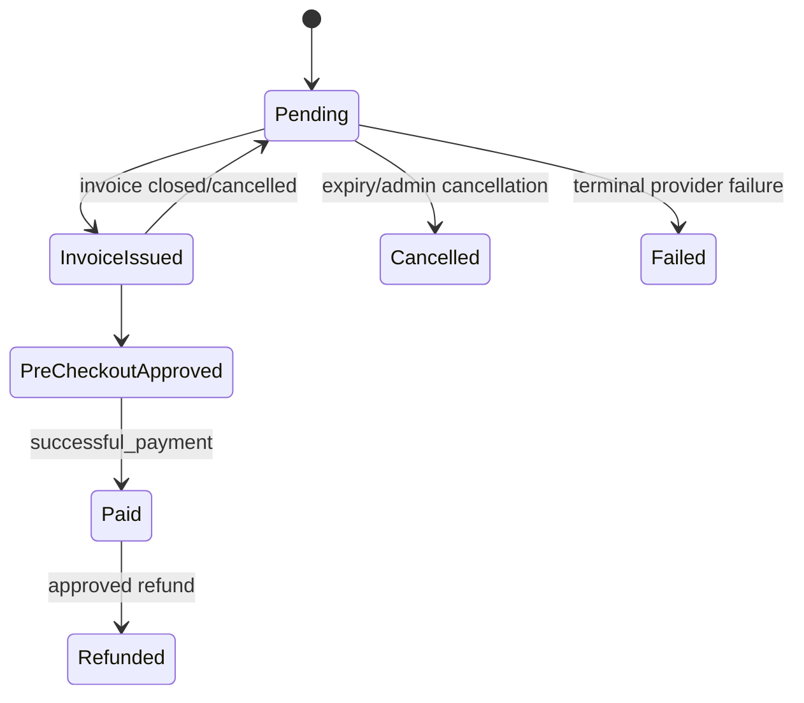
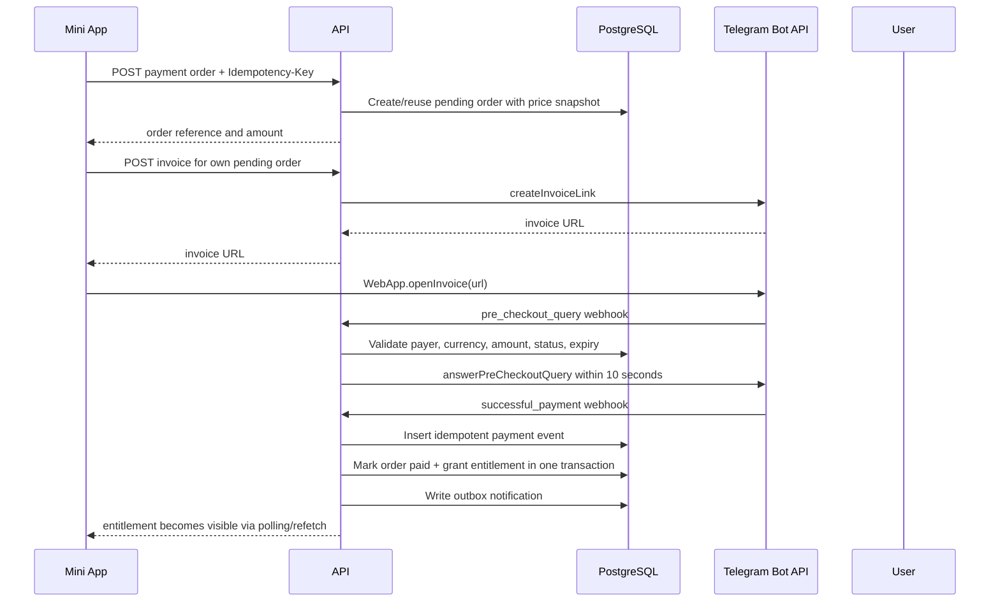
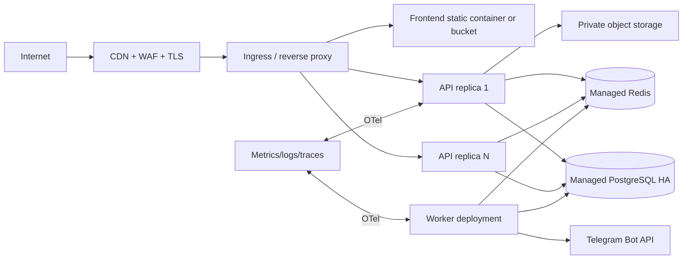

# BloggerBazar v1 — Technical Specification

**Status:** Proposed v1 baseline
**Date:** 2026-07-27
**Audience:** Product, engineering, operations, security, payment and QA teams
**Normative language:** MUST, SHOULD and MAY are used as defined in RFC 2119.

## 1. Purpose and Scope

BloggerBazar is a Telegram Mini App marketplace connecting businesses in Uzbekistan with creators. v1 provides verified creator profiles, business profiles, campaign applications, direct offers, deals, reviews, protected contact access, paid entitlements, moderation and operational administration.

This document is the target-state specification. It intentionally replaces the temporary dual ASP.NET/Node runtime with a single ASP.NET Core runtime and a single PostgreSQL schema. Existing implementation details that contradict this document are migration work, not v1 design decisions.

### 1.1 Product invariants

1. A Telegram user is the only end-user identity source; the server validates Telegram Mini App `initData` for every protected action.
2. A user MAY own both a blogger and a business profile.
3. Phone, email, Telegram username, social-account URLs and private media MUST never appear in public profile responses.
4. A contact is visible only to its owner or to a user with an active server-side entitlement for that exact target.
5. An entitlement is granted only from a confirmed, idempotent payment event.
6. Only approved blogger profiles appear in public search.
7. Reviews are allowed only after a completed deal and only by the counterparty.
8. Every state-changing payment, moderation and entitlement action is auditable.

### 1.2 Non-goals for v1

- Native mobile apps.
- Full real-time chat; v1 uses direct offers and optional Telegram notifications.
- AI recommendation or external search engines.
- Multi-country taxation and multi-currency settlement.
- Direct Click Shop API integration before Click supplies a signed production contract.

## 2. Final Architecture



### 2.1 Components

| Component | Responsibility | Availability target |
|---|---|---|
| React Mini App | Mobile UI, Telegram SDK calls, no business authorization decisions | Static CDN, 99.9% |
| Edge/Ingress | TLS, WAF, compression, CSP, routing, request limits | 99.9% |
| ASP.NET Core API | REST API, auth, application commands/queries, webhooks | Stateless, horizontally scalable |
| PostgreSQL | Source of truth for users, marketplace, payments, audits and outbox | Managed HA, PITR enabled |
| Redis | Cache, distributed rate limiting, short-lived idempotency/cache coordination | Managed/replicated |
| Worker | Outbox delivery, notifications, reconciliation, expiry jobs | At least one active instance |
| Object storage | Creator media originals and derivatives | Private bucket + signed delivery |
| Telegram Bot API | Authentication context, invoices, payment updates, notifications | External dependency |

### 2.2 Layering rules



- **Domain:** entities, value objects, transitions and invariants only.
- **Application:** commands, queries, DTOs, validators, authorization policies and ports.
- **Infrastructure:** EF Core, Redis, Telegram, object storage, payment adapters and worker implementations.
- **API:** HTTP contracts, request identity extraction, composition root, observability and middleware.
- API MUST NOT expose persistence entities or depend on provider-specific implementation types.

## 3. Domain Model and ER Diagram



### 3.1 Core PostgreSQL schema

| Table | Essential fields | Keys and constraints |
|---|---|---|
| `telegram_users` | `id uuid`, `telegram_user_id bigint`, `username`, `locale`, timestamps | unique `telegram_user_id` |
| `blogger_profiles` | `user_id`, display data, private contact, metrics, `status`, moderation version | unique `user_id`; status check; public/private fields separated at DTO boundary |
| `business_profiles` | `user_id`, company data, private contact, verification status | unique `user_id` |
| `social_accounts` | `blogger_id`, `platform`, `handle`, `url`, followers, reach, verified timestamp | unique `(blogger_id, platform, handle)` |
| `media_assets` | `owner_user_id`, object key, type, checksum, moderation status | object key unique; never store arbitrary executable URL |
| `portfolio_items` | `blogger_id`, `media_asset_id`, title, display order | index `(blogger_id, display_order)` |
| `categories` / `profile_categories` | canonical multilingual taxonomy | unique slug; join-table indexes both directions |
| `cities` | canonical city/code | unique code |
| `campaigns` | `business_id`, copy, budget, city, `status`, promotion period | indexes for published catalog and business dashboard |
| `campaign_categories` | campaign/category join | unique `(campaign_id, category_id)` |
| `campaign_applications` | campaign/blogger/message/status | unique `(campaign_id, blogger_id)` |
| `direct_offers` | business/blogger/copy/status/expiry | index receiver and sender status queues |
| `deals` | source type/id, business/blogger, status, terms snapshot | one source per deal; no mutable source after acceptance |
| `deal_confirmations` | deal, participant user, action, timestamp | unique `(deal_id, user_id, action_type)` |
| `reviews` | deal, reviewer, target, rating, comment | unique `(deal_id, reviewer_user_id)`; rating check 1..5 |
| `payment_orders` | reference, payer, product type, target, currency, amount, status, expiry | unique reference; provider transaction uniqueness |
| `payment_events` | provider event ID, order, raw payload hash, status, received timestamp | unique `(provider, provider_event_id)` |
| `entitlements` | grantee, resource type/id, source order, starts/expires | unique active entitlement per resource/grantee |
| `subscriptions` | plan, user/business, provider identifiers, state, period | provider subscription uniqueness |
| `promotion_orders` | promoted resource, period, payment order, state | prevent overlapping active promotion conflicts |
| `notifications` | recipient, type, payload, read/delivery state | index `(recipient_user_id, read_at, created_at desc)` |
| `outbox_messages` | type, payload, occurred time, processed/attempt state | index unprocessed queue |
| `audit_logs` | actor, action, entity, before/after hashes, request ID | append-only, time partitionable |

### 3.2 Database rules and indexes

1. All timestamps MUST be `timestamptz` and stored in UTC.
2. IDs SHOULD be UUIDv7/ordered UUID to reduce B-tree fragmentation.
3. Money MUST be integer minor units plus ISO currency, never floating point.
4. Public catalog indexes:
   - partial index for approved bloggers ordered by promotion and ranking;
   - partial index for published campaigns ordered by promotion and creation;
   - GIN indexes for categories only if arrays remain; join tables are preferred for taxonomy.
5. PostgreSQL `CHECK` constraints MUST enforce rating range, non-negative budgets, valid budget range, valid state values and exclusive review target semantics.
6. Historical payment/deal/review records MUST use `RESTRICT`; user-facing deletion is soft delete/anonymization.
7. `xmin` or explicit version columns MUST protect concurrent profile and moderation updates.
8. Database migrations MUST be forward-only, reviewed, tested against a production-like copy and applied by a dedicated release job.

## 4. API Specification

### 4.1 Conventions

- Base path: `/api/v1`.
- JSON uses camelCase.
- Protected requests use `Authorization: tma <Telegram initData>`.
- Errors use RFC 9457 Problem Details with stable machine `code`; internal messages are never exposed.
- Lists use cursor pagination:

```json
{
  "items": [],
  "pageInfo": { "nextCursor": "opaque", "hasNextPage": true }
}
```

- Idempotent POST commands accept `Idempotency-Key` where duplicate financial or creation effects matter.
- Public DTOs MUST exclude every direct-contact field.

### 4.2 Endpoint catalogue

| Method | Path | Auth | Purpose |
|---|---|---:|---|
| GET | `/bloggers` | Public | Search approved bloggers by category, city, reach, price, rating and cursor |
| GET | `/bloggers/{id}` | Public | Public blogger detail without direct contact |
| GET/PUT | `/bloggers/me` | TMA | Read/update own creator profile |
| POST | `/bloggers/me/media/upload-url` | TMA | Create signed object-storage upload intent |
| GET | `/businesses/{id}` | Public | Public business card, no contact |
| GET/PUT | `/businesses/me` | TMA | Read/update own business profile |
| GET/POST | `/campaigns` | Public/TMA | Search published campaigns / create draft |
| GET/PATCH | `/campaigns/{id}` | Public/Owner | Public detail / owner update |
| POST | `/campaigns/{id}/publish` | Owner | Submit/publish according to moderation policy |
| POST | `/campaigns/{id}/archive` | Owner | Archive campaign |
| POST | `/campaigns/{id}/applications` | Blogger | Apply to campaign |
| POST | `/campaign-applications/{id}/accept` | Business | Accept application and create deal |
| POST | `/campaign-applications/{id}/reject` | Business | Reject application |
| POST | `/campaign-applications/{id}/withdraw` | Blogger | Withdraw own application |
| GET/POST | `/direct-offers` | TMA | List own offers / create offer to creator |
| POST | `/direct-offers/{id}/accept` | Blogger | Accept and create deal |
| POST | `/direct-offers/{id}/reject` | Blogger | Reject offer |
| GET | `/deals` | TMA | List caller deals |
| POST | `/deals/{id}/complete-confirmations` | Participant | Confirm completion |
| POST | `/deals/{id}/disputes` | Participant | Open dispute before completion |
| POST | `/deals/{id}/reviews` | Participant | Review eligible counterparty |
| POST | `/payments/contact-unlocks` | TMA | Create/reuse pending order |
| POST | `/payments/orders/{reference}/invoice` | TMA | Create native Telegram invoice link |
| GET | `/entitlements/contacts/{type}/{id}` | TMA | Read unlock state |
| GET | `/contacts/{type}/{id}` | TMA | Return contact only with entitlement/ownership |
| POST | `/webhooks/telegram` | Telegram secret | Process bot, pre-checkout and successful payment updates |
| GET | `/admin/moderation/bloggers` | Admin | Moderation queue |
| POST | `/admin/moderation/bloggers/{id}/approve` | Admin | Approve/reject with audit reason |
| GET | `/admin/payments` | Admin | Reconciliation/dispute queue |

### 4.3 API authorization matrix

| Resource | Public | Owner | Counterparty | Admin |
|---|---:|---:|---:|---:|
| Public blogger card | Read | Read | Read | Read |
| Blogger private contact | No | Read | Only active entitlement | Read with audit |
| Campaign | Published read | Business CRUD | Apply only | Moderate |
| Application | No | Blogger own read/withdraw | Campaign owner read/decide | Read |
| Deal | No | Participant read/confirm | Participant read/confirm | Read/dispute action |
| Payment/order | No | Payer read | No | Reconcile/refund |

## 5. Target Folder Structure

```text
BloggerBazar/
  src/
    BloggerBazar.Domain/
      Entities/ ValueObjects/ Events/ Policies/ Enums/
    BloggerBazar.Application/
      Abstractions/
      Features/
        Identity/ Bloggers/ Businesses/ Campaigns/ Offers/ Deals/
        Payments/ Entitlements/ Moderation/ Notifications/
      Behaviors/ Authorization/ Validation/
    BloggerBazar.Infrastructure/
      Persistence/
        Configurations/ Repositories/ Migrations/
      Caching/ Payments/ Telegram/ Storage/ Messaging/ Observability/
    BloggerBazar.Api/
      Controllers/ Contracts/ Middleware/ Authentication/ OpenApi/
    BloggerBazar.Worker/
      Jobs/ Outbox/ Reconciliation/ Expiry/
  tests/
    Domain.Tests/ Application.Tests/ Infrastructure.IntegrationTests/
    Api.IntegrationTests/ Frontend.E2E/
  frontend/
    src/
      app/ api/ components/ features/ hooks/ i18n/ lib/ pages/ styles/
  deploy/
    compose/ helm/ terraform/ nginx/
  docs/
    adr/ runbooks/ api/
```

## 6. Telegram Flow



### Telegram requirements

- The API MUST validate Telegram’s HMAC server-side for every protected request.
- `auth_date` MUST be inside a configured max age and a small future clock skew.
- `initDataUnsafe` MUST never be used as an authorization source.
- The bot webhook MUST use Telegram’s `X-Telegram-Bot-Api-Secret-Token` and HTTPS.
- Telegram user ID is stored as `bigint`; JavaScript MUST not truncate it.

## 7. Payment and Entitlement Flow

### 7.1 Payment policy

Contact unlock and PRO access are digital entitlements. For production inside Telegram, payment method selection MUST follow Telegram policy. Telegram’s digital-goods guidance requires Telegram Stars (`XTR`); Click is retained only behind a provider abstraction for a legally eligible, approved flow or external/off-platform settlement. [Telegram digital-goods guidance](https://core.telegram.org/bots/payments-stars)

### 7.2 Payment state machine



### 7.3 Invoice sequence



### 7.4 Payment controls

1. `payment_events` MUST retain provider event ID, Telegram charge ID, provider charge ID when supplied, amount, currency and payload hash.
2. Event processing MUST be idempotent through database unique constraints, not only in-memory checks.
3. Orders MUST have expiry; stale pending orders cannot be paid indefinitely.
4. A worker MUST reconcile provider status and alert on unmatched/failed events.
5. Refund/chargeback MUST revoke or flag the linked entitlement according to policy and be audited.
6. Client invoice callback is UX only; it MUST never grant access.

## 8. Redis Strategy

| Key family | Example | TTL | Invalidation / owner |
|---|---|---:|---|
| Public creator catalog | `catalog:bloggers:v{version}:{filters}:{cursor}` | 60–300 sec | Domain event on approved profile/category/promotion change |
| Campaign catalog | `catalog:campaigns:v{version}:{filters}:{cursor}` | 60–300 sec | Domain event on publish/archive/update/promotion |
| Profile detail | `profile:{id}:public:v{version}` | 5 min | Profile update/moderation |
| Distributed rate limit | framework-managed | 1–60 sec | Sliding/fixed window policy |
| Idempotency response | `idem:{actor}:{key}` | 24 hr | Expiry only |
| Short webhook dedupe | `payment-event:{provider}:{event}` | 24 hr | Database remains source of truth |

- Redis MUST NOT be the source of truth for payments, entitlements or moderation.
- Cache writes MUST tolerate Redis unavailability; cache read failure falls back to PostgreSQL.
- Use versioned keys or explicit invalidation. Do not rely solely on TTL for correctness-sensitive visibility.
- Distributed rate limits MUST be applied at edge and API. Trusted forwarded IP configuration is mandatory.

## 9. Security Model

### 9.1 Threat controls

| Threat | Control |
|---|---|
| Forged Telegram identity | Server-side `initData` HMAC and freshness validation |
| Contact bypass | Public/private DTO split and entitlement check in API |
| IDOR | Resource authorization policy receives authenticated Telegram user ID |
| Webhook spoofing | Telegram webhook secret, HTTPS, event uniqueness and amount verification |
| Payment replay | Provider event uniqueness, exact order snapshot validation, idempotency keys |
| SQL injection | EF parameterization; no raw user-supplied SQL |
| Stored XSS/open redirect | React escaping, HTTPS-only URL validation, CSP, no arbitrary HTML |
| Brute force/abuse | Edge WAF plus distributed endpoint-specific rate limits |
| Secret exposure | Secret manager, rotated credentials, no secrets in images/logs/repository |
| PII misuse | Private fields, access audits, encryption/managed database encryption, retention policy |

### 9.2 Roles

- **Anonymous:** public catalog only.
- **Telegram user:** own profiles, applicable marketplace actions.
- **Blogger:** campaign applications, received offers, own deals/reviews.
- **Business:** campaigns, sent offers, received applications, own deals/reviews.
- **Moderator:** approve/reject profiles and campaigns according to scoped allow-list/RBAC.
- **Finance admin:** reconciliation/refund workflow, never unrestricted raw PII by default.

### 9.3 Operational security requirements

- TLS terminates before API; enforce HSTS in production.
- Ingress MUST set CSP, `X-Content-Type-Options`, referrer policy and restrictive frame ancestors compatible with Telegram.
- Containers MUST run non-root, use immutable tagged/digested images and have read-only root filesystem where possible.
- PostgreSQL backups MUST be encrypted, tested through restore drills, and protected by least-privilege credentials.
- Logs MUST redact Authorization, webhook secrets, tokens, contact data and payment payloads.

## 10. Deployment Architecture



### 10.1 Environments

| Environment | Required differences |
|---|---|
| Local | Docker Compose, fake payment provider, local MinIO optional |
| Staging | Isolated Telegram test bot, production-like managed DB/Redis, migration rehearsal |
| Production | Managed HA PostgreSQL/Redis, secrets manager, TLS/WAF, backups, alerts, live provider configuration |

### 10.2 Release process

1. CI runs formatting, static analysis, unit/integration/API/E2E tests, dependency and container scans.
2. Build immutable API, worker and frontend artifacts.
3. Run reviewed migration job once, backed up and independently observable.
4. Deploy API/worker using rolling or blue-green strategy.
5. Run smoke tests: health, authenticated request, webhook signature rejection, payment test flow.
6. Monitor error rate, latency, queue lag and payment reconciliation before full rollout.

## 11. Observability and Reliability

### Required signals

- Structured logs with request ID, actor type and correlation ID.
- OpenTelemetry traces across API, PostgreSQL, Redis, Telegram and worker jobs.
- Metrics: HTTP latency/errors, DB pool saturation, slow queries, Redis availability, cache hit rate, outbox lag, webhook failures, invoice conversion and entitlement grants.
- Alerts: failed migrations, backup failure, payment mismatch, webhook 4xx/5xx spike, outbox age, high error rate, low disk/connection headroom.

### Service level objectives

| SLI | v1 target |
|---|---:|
| Public catalog/API availability | 99.9% monthly |
| Protected command success excluding user validation | 99.5% monthly |
| P95 public catalog latency | under 400 ms |
| Payment event processing | under 60 sec after provider success |
| Outbox delivery | 99% under 2 min |
| RPO / RTO | 15 min / 4 hr initially |

## 12. Future Scaling Plan

### Phase 1 — Production launch

- One ASP.NET API deployment, one worker, managed PostgreSQL and Redis.
- CDN-backed frontend, object storage for media, full audit/payment outbox.
- Cursor pagination and PostgreSQL search indexes.

### Phase 2 — Growth

- Horizontal API replicas with distributed rate limits.
- Read replica for catalog/reporting where justified.
- Background media processing, notification retries and moderation queues.
- Materialized aggregates for ratings/reach/ranking.

### Phase 3 — Marketplace scale

- OpenSearch/Elasticsearch for full-text and faceted discovery.
- Recommendation service fed by event stream, strictly opt-in analytics.
- Partition high-volume audit/payment/notification tables by time.
- Dedicated finance and moderation back-office services only after bounded-context pressure is proven.

## 13. Required Test Strategy

| Level | Mandatory coverage |
|---|---|
| Domain/unit | state transitions, entitlement invariants, payment idempotency |
| Application | authorization policies, validation, moderation and deal flows |
| Infrastructure integration | PostgreSQL constraints/indexes/migrations, Redis failure fallback, object storage |
| API integration | Telegram initData, IDOR, public DTO privacy, Problem Details, rate limits |
| Webhook contract | pre-checkout timing, signature rejection, duplicate event, amount mismatch |
| Frontend | i18n, loading/error/empty states, accessibility, payment UX |
| E2E staging | Telegram test bot, invoice, entitlement grant, contact unlock and refund path |
| Security | SAST, dependency scan, container scan, DAST and periodic penetration test |

## 14. Acceptance Criteria for v1 Launch

- One backend and one canonical migration lineage are deployed.
- No public response contains direct-contact data.
- All paid access is server-enforced through active entitlements.
- Payment provider choice is approved for the product type and end-to-end verified in staging.
- PostgreSQL constraints/indexes, migration job, backups and restore drill are complete.
- CI/CD, monitoring, TLS/WAF, readiness checks and incident runbooks are active.
- API, webhook and E2E tests cover the critical user/payment flows.
- Product, security and operations owners formally sign off on this specification.
